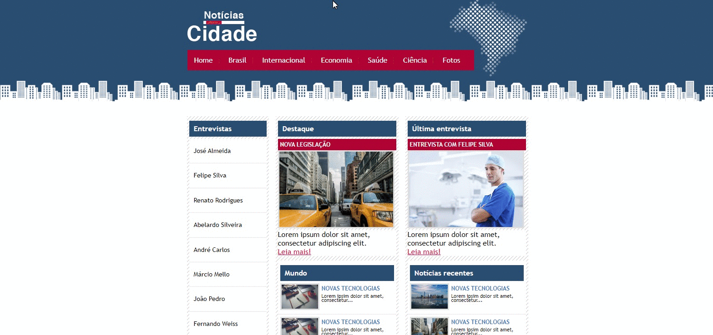

# Noticia cidade
 
<h1 align="center">
    
</h1>

<h1>
    

</h1>

<h3 align="center">
    <a href="https://rodolforios.github.io/Noticia-cidade/">Acessar a demonstração</a>
<h3 >

# Indice

- [Sobre](#-sobre)
- [Tecnologias Utilizadas](#-tecnologias-utilizadas)
- [Como baixar o projeto](#-como-baixar-o-projeto)

## 🔖&nbsp; Sobre

O Site **Notícia Cidade**  foi criado dentro do curso **Desenvolvimento Web Completo 2021** com o intuito de colocarmos em prática todo conteúdo estudado durante o curso.


---

## 🚀 Tecnologias utilizadas

O projeto foi desenvolvido utilizando as seguintes tecnologias


- [HTML](https://developer.mozilla.org/pt-BR/docs/Web/HTML)
- [CSS](https://developer.mozilla.org/pt-BR/docs/Web/CSS)


---

## 🗂 Como baixar o projeto

```bash

    # Clonar o repositório
    $ git clone https://github.com/rodolforios/Noticia-cidade

    # Entrar no diretório
    $ cd Noticia-cidade
   

    # Iniciar o projeto
    $ index.html
```

 

